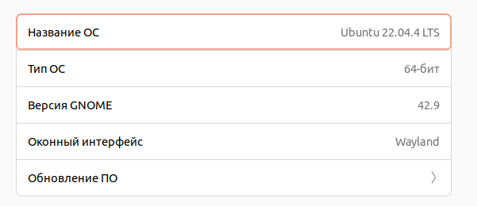
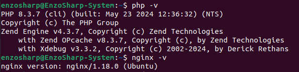
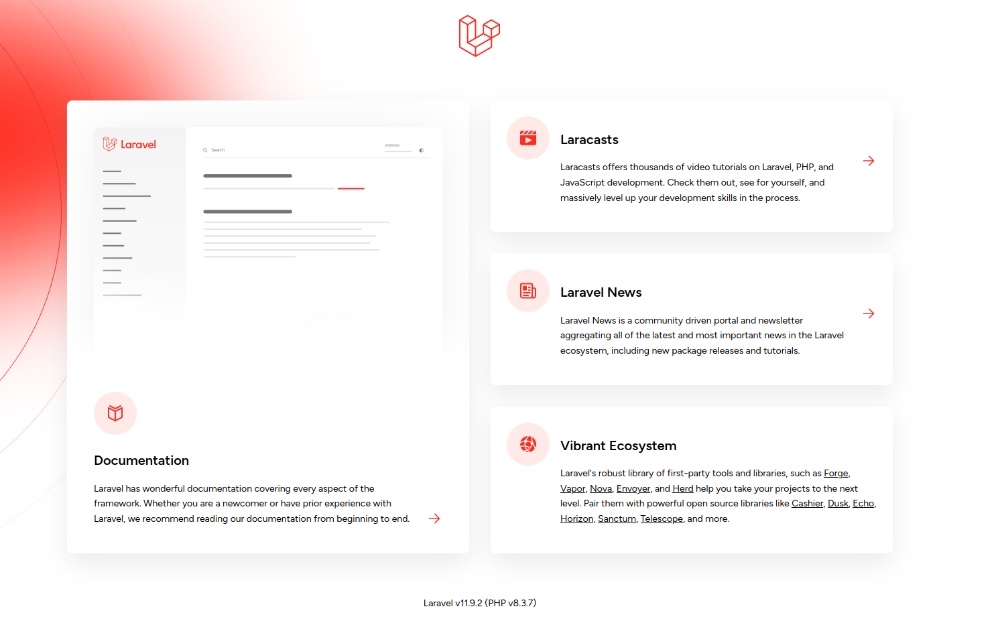
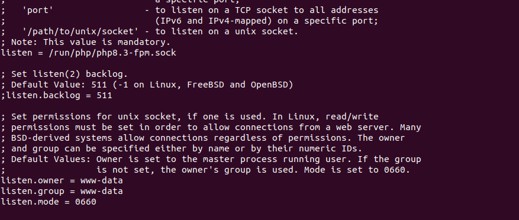

    ДЗ №1

    Среда разработки Linux на железе система Ubuntu 22.04
    
     
    <ul>
        <li>
            php 8.3
        </li>
        <li>
            nginx
        </li>
        <li>
            nginx+fpm соеденены через сокер
        </li>
    </ul>
    
    
    

